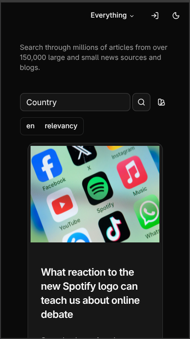
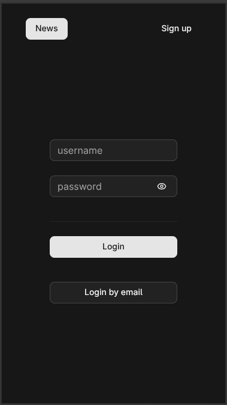

# News Aggregator

[](https://fastapi.tiangolo.com/)
[](https://reactjs.org/)
[](https://www.typescriptlang.org/)
[](https://www.docker.com/)

A scalable and asynchronous web application for real-time news aggregation from multiple external sources. Designed with a clean architectural approach, focusing on extensibility, high performance, and secure user management.

## Screenshots

<table border="0">
  <tr>
    <td></td>
    <td></td>
    <td></td>
  </tr>
</table>

## Key Features & Architecture

- **Clean Architecture & DDD:** Implemented Domain-Driven Design principles with the **Adapter Pattern**, allowing seamless integration of new third-party News APIs without modifying the core business logic.
- **Asynchronous Data Fetching:** Utilizes `aiohttp` and `FastAPI` to fetch data from external endpoints concurrently, ensuring low latency.
- **Robust Authentication:** Secure user authentication implemented via **OAuth2 with JWT tokens** (stateless session management).
- **Background Notifications:** Asynchronous background email notifications built with `smtplib` and `EmailMessage` to update users without blocking the main event loop.
- **Modern Responsive UI:** Built as a Single Page Application (SPA) using React, TypeScript, and beautifully styled with **shadcn/ui**.

## Tech Stack

- **Backend:** Python 3.11+ (FastAPI), SQLAlchemy 2.0 (Async), Pydantic v2, Alembic, Aiohttp
- **Frontend:** React (SPA), TypeScript, Tailwind CSS, shadcn/ui
- **Databases & DevOps:** PostgreSQL, Redis, Docker & Docker Compose
---

## Installation & Setup

Follow these steps to spin up the entire environment (Backend, Frontend, DB, Redis) locally using Docker.

### 1. Clone the repository
```bash
git clone [https://github.com/Arseniy-B/News.git](https://github.com/Arseniy-B/News.git)
cd News
```
### 2. Configure Environment Variables
Create a .env file inside the back/ directory and update the credentials:
```bash
# Infrastructure configuration
REDIS_HOST=redis
REDIS_PORT=6379
DB_HOST=db
DB_PORT=5432

# Database Credentials
DB_USER=your_secure_db_user
DB_PASS=your_secure_db_password
DB_NAME=news_aggregator_db

# External APIs
# Get your free token at [https://newsapi.org](https://newsapi.org)
API_KEY=your_newsapi_key

# SMTP Email Configuration
# Note: Some providers require an "App Password" instead of your main password.
EMAIL_ADDRESS=your_email@domain.com
EMAIL_PASSWORD=your_smtp_app_password
SMTP_SERVER=smtp.yourprovider.com
```

### 3. Run via Docker Compose
Ensure you have Docker installed, then run:
```bash
docker compose up --build
Once the build is complete, the application will be accessible at:
```

Frontend Dashboard: http://localhost:5173

Interactive API Documentation (Swagger): http://localhost:8000/docs
